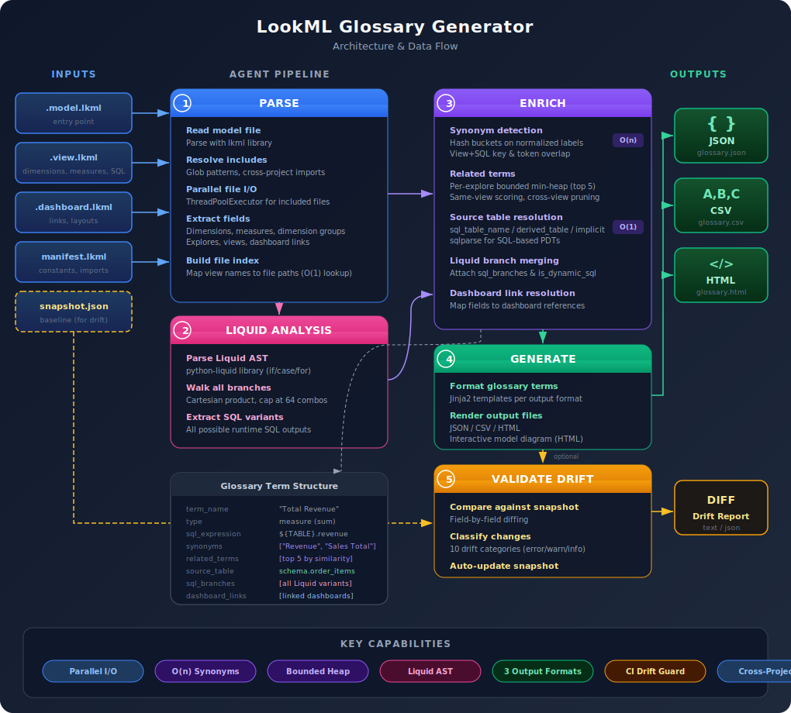

# LookML Glossary Generator

A Python agent that parses LookML model files and generates a structured, enriched glossary of business terms. It extracts measures, dimensions, dimension groups, parameters, and dashboard links — then enriches them with related terms, source table and joined table resolution, natural-language join descriptions, and Liquid template branch analysis. Term names are automatically disambiguated to be unique. Includes a **drift validator** that detects when LookML changes make glossary terms obsolete, with CI integration for automated monitoring.

**[Live Demo: Healthcare Glossary](https://pragati-sharma-29.github.io/Glossary-generator/healthcare_demo/)** | **[E-Commerce Glossary](https://pragati-sharma-29.github.io/Glossary-generator/ecommerce.html)**

## How It Works

<p align="center">
  
</p>

## Features

### Parsing
- Parses `.model.lkml` files and all included views/dashboards
- **Parallel file I/O** — included files are parsed concurrently via `ThreadPoolExecutor`
- **Full glob include resolution** — supports `**/*.view.lkml`, subdirectory patterns, and exact paths
- **Cross-extension matching** — `.lkml` include patterns automatically match `.lookml` files and vice versa
- **Cross-project imports** — resolves `local_dependency` from `manifest.lkml`; logs `remote_dependency` with instructions
- Extracts **measures** (sum, count, average, etc.), **dimensions**, **dimension groups**, **parameters**, and **filters**
- **Dimension group timeframe expansion** — a `dimension_group` with `timeframes: [date, week, month]` produces 3 individual glossary terms (e.g., `created_date`, `created_week`, `created_month`)
- **Explore `extends` resolution** — recursively follows explore inheritance chains to collect all joins (handles both `extends` and `extends__all` formats)
- Captures **table names**, **view names**, and **explore context** in each term
- Captures **dashboard links** from both LookML syntax (`.dashboard.lkml`) and **YAML format** (`.dashboard.lookml`) dashboards
- Captures **recommended links** from LookML `link` blocks
- **Structured aspects** — extracts `group_label`, `label`, `primary_key`, `drill_fields`, `filters`, `actions`, joins, and other metadata as key-value aspects (separate from plain-text descriptions)
- **Hidden field detection** — tracks `hidden: yes` fields with `--exclude-hidden` CLI option to filter them from output

### Enrichment
- **Related terms** — top-5 per field using a bounded min-heap with view pre-bucketing and per-explore parallelism; identity-level matches (synonyms) are excluded to avoid redundancy
- **Related term hyperlinks** — related terms are rendered as navigable anchor links in HTML/webapp output
- **Related entries resolution** — resolves source tables for each field via `sql_table_name`, `derived_table`, `explore_source`, or implicit naming; also includes tables from joined views
- **Join table resolution** — tables referenced by joined views are automatically added to `related_entries` with `source_type: "joined_table"`
- **Natural-language join descriptions** — join relationships (type and linked fields) are described in plain English within term descriptions
- **Unique term names** — two-pass disambiguation ensures every term has a unique name: measures get aggregation prefixes (e.g., "Total Orders Revenue"), remaining duplicates get view name suffixes
- **Liquid template branch extraction** — parses ``, ``, `` via AST to enumerate all possible SQL outputs without evaluating runtime expressions

### Drift Validation
- Compares a saved JSON glossary snapshot against current LookML source
- Detects removed fields, SQL changes, type changes, tag changes, and more
- **CI integration** — GitHub Actions workflow validates drift automatically on merged PRs

### Output Formats
- **JSON**, **CSV**, **Markdown**, **HTML**, and **interactive Webapp** (with model diagram, search, filters, and CSV download)

## Installation

### From PyPI (recommended)

```bash
pip install lookml-glossary
```

This installs the `lookml-glossary` CLI command and the `lookml_glossary` Python package.

### From source

```bash
git clone https://github.com/Pragati-Sharma-29/Glossary-generator.git
cd Glossary-generator
pip install .
```

### Development install

```bash
git clone https://github.com/Pragati-Sharma-29/Glossary-generator.git
cd Glossary-generator
pip install -e ".[dev]"
```

## Quick Start

### Add to your LookML project

```bash
# 1. Install the package
pip install lookml-glossary

# 2. Generate a glossary from your model
lookml-glossary generate your_model.model.lkml -f webapp -o glossary.html

# 3. Create a baseline snapshot for drift detection
lookml-glossary generate your_model.model.lkml -f json -o glossary_snapshot.json

# 4. Later, check if your LookML changed
lookml-glossary validate your_model.model.lkml -s glossary_snapshot.json
```

## Usage

### Generate a Glossary

```bash
# Generate Markdown glossary (default)
lookml-glossary generate your_model.model.lkml

# Generate JSON
lookml-glossary generate your_model.model.lkml -f json

# Generate HTML with search
lookml-glossary generate your_model.model.lkml -f html -o glossary.html

# Generate CSV
lookml-glossary generate your_model.model.lkml -f csv -o glossary.csv

# Generate interactive webapp with model diagram
lookml-glossary generate your_model.model.lkml -f webapp -o glossary.html

# Include additional directories for LookML files
lookml-glossary generate model.lkml -I ./views -I ./dashboards
```

> **Note**: `python -m lookml_glossary` also works. You can omit the `generate` subcommand when passing a `.lkml` path directly (e.g., `lookml-glossary model.lkml -f json`).

### Validate Glossary Drift

The validator compares a previously saved JSON glossary snapshot against the current state of your LookML files and reports any drift.

```bash
# First, generate a baseline snapshot
lookml-glossary generate your_model.model.lkml -f json -o glossary_snapshot.json

# Validate against the snapshot (shows warnings and errors)
lookml-glossary validate your_model.model.lkml -s glossary_snapshot.json

# Show all severity levels including info
lookml-glossary validate your_model.model.lkml -s glossary_snapshot.json --severity info

# Output drift report as JSON
lookml-glossary validate your_model.model.lkml -s glossary_snapshot.json -f json

# Exit non-zero on warnings (not just errors) — useful for CI
lookml-glossary validate your_model.model.lkml -s glossary_snapshot.json --fail-on warning

# Validate and update the snapshot to the current state
lookml-glossary validate your_model.model.lkml -s glossary_snapshot.json --update-snapshot
```

#### Drift Categories

| Category | Severity | Description |
|----------|----------|-------------|
| `removed_field` | error | Field exists in snapshot but was removed from LookML |
| `new_field` | warning | Field exists in LookML but is not in the snapshot |
| `sql_changed` | warning | SQL expression changed for an existing field |
| `type_changed` | error | Field type or measure type changed |
| `table_renamed` | warning | Underlying table name changed |
| `view_removed` | error | All fields from a view have been removed |
| `explore_removed` | error | All fields from an explore have been removed |
| `kpi_reclassified` | warning | Metric or KPI classification flag changed |
| `description_changed` | info | Base description text changed |
| `tags_changed` | info | Tag set changed |

#### Validate CLI Options

| Option | Description |
|--------|-------------|
| `-s, --snapshot <path>` | Path to the JSON glossary snapshot (required) |
| `-f, --format <fmt>` | Output format: `text` or `json` (default: `text`) |
| `-o, --output <path>` | Write report to file instead of stdout |
| `--severity <level>` | Minimum severity to display: `info`, `warning`, `error` (default: `warning`) |
| `--fail-on <level>` | Exit non-zero if any drift at this level: `info`, `warning`, `error` (default: `error`) |
| `--update-snapshot` | Overwrite the snapshot with the current glossary after validation |

### As a Library

```python
from lookml_glossary.parser import parse_lookml_model
from lookml_glossary.generator import generate_json, generate_webapp

terms = parse_lookml_model("path/to/model.model.lkml")

for term in terms:
    print(f"{term.term_type}: {term.name} - {term.description}")
    if term.aspects:
        print(f"  Aspects: {term.aspects}")
    if term.is_hidden:
        print("  [hidden]")
    if term.is_dynamic_sql:
        print(f"  Dynamic SQL with {len(term.sql_branches)} branches:")
        for branch in term.sql_branches:
            print(f"    - {branch}")
    if term.dashboard_links:
        print(f"  Dashboards: {[dl.title for dl in term.dashboard_links]}")
    if term.related_terms:
        print(f"  Related: {[r['term_name'] for r in term.related_terms]}")
    if term.related_entries:
        print(f"  Source: {[r['name'] for r in term.related_entries]}")
```

## Glossary Term Format

Each glossary entry contains:

| Field | Description |
|-------|-------------|
| `term_name` | Human-readable name (unique — disambiguated with aggregation prefix or view suffix) |
| `description` | Plain-text business description with natural-language join context |
| `type` | `dimension`, `measure`, or `parameter` |
| `field_id` | Unique `view_name.field_name` identifier |
| `view_name` | LookML view name |
| `explore_name` | LookML explore name |
| `model_name` | LookML model name |
| `measure_type` | Type of measure (sum, count, average, etc.) |
| `sql_expression` | The SQL definition (may contain Liquid tags for dynamic fields) |
| `value_format` | Display format |
| `tags` | LookML tags |
| `is_hidden` | `true` if the field has `hidden: yes` |
| `aspects` | Structured key-value metadata (group_label, label, primary_key, drill_fields, filters, actions, joins, timeframe, parameter_type, etc.) |
| `dashboard_links` | Links to dashboards using this field |
| `recommended_links` | Links defined in the LookML `link` block |
| `related_terms` | Complementary fields in the same explore (max 5, hyperlinked in output) |
| `related_entries` | Resolved source table(s) including joined view tables (`source_type: "joined_table"`) |
| `is_dynamic_sql` | `true` if the SQL contains Liquid template tags |
| `sql_branches` | All possible SQL outputs from Liquid branch analysis |

## Enrichment Details

### Related Terms

For each field, up to 5 related terms are selected from the same explore using a bounded min-heap. Identity-level matches (synonyms with similarity >= 0.9) are excluded to avoid redundancy.

1. **Same-view terms scored first** — guaranteed +0.5 base score fills the heap quickly
2. **Cross-view pruning** — when the heap minimum reaches 0.5, cross-view terms (max possible 0.5) are skipped entirely
3. **Per-explore parallelism** — each explore runs in its own thread
4. **Hyperlinked output** — related terms render as navigable anchor links in HTML/webapp formats

### Related Entries Resolution

Each field's source table is resolved by parsing LookML view files. A one-time file index maps every `view: name {` definition to its file path for O(1) lookups.

Four resolution patterns in priority order:

1. **`sql_table_name`** — explicit physical table reference (supports `${constant}` and `@{constant}` templating)
2. **`derived_table` with `sql`** — extracts FROM/JOIN table references using sqlparse (no size limit)
3. **`derived_table` with `explore_source`** — native derived tables
4. **Implicit** — view name used as table name when no explicit source is defined

Additionally, tables from **joined views** are resolved and added with `source_type: "joined_table"`, giving a complete picture of all data sources accessible through a field's explore.

Supports recursive view reference resolution (depth limit 10) and cross-project file discovery.

### Term Name Disambiguation

Term names are made unique via a two-pass process:

1. **Aggregation prefix** — duplicate measure names get a descriptive prefix based on their measure type (e.g., "Total Orders Revenue", "Count Of Users Id", "Average Orders Amount")
2. **View name suffix** — any remaining duplicates get their view name appended in parentheses (e.g., "Created Date (Orders)")

### Natural-Language Join Descriptions

Join relationships are described in plain English within term descriptions. For each join, the generator extracts the relationship type and `sql_on` field references:

> "This field can be analyzed joined to Users (many-to-one) on User Id = Id."

### Liquid Template Branch Extraction

LookML fields can use Liquid templates (``, ``) to produce different SQL at runtime depending on user attributes, filters, or dialect. Since the glossary generator has no runtime context, it performs **static analysis**:

1. Parses the Liquid template into an AST using `python-liquid`
2. Walks every `if/elsif/else` and `case/when` branch
3. Collects all possible SQL text outputs (Cartesian product of nested branches)
4. Caps at 64 combinations to prevent exponential blowup
5. Falls back to regex splitting if `python-liquid` is not installed

**Example**: A dimension with region-specific SQL:

```lookml
dimension: region_column {
  sql:
    
      ${TABLE}.region_eu
    
      ${TABLE}.region_apac
    
      ${TABLE}.region_global
     ;;
}
```

Produces a glossary entry with:

```json
{
  "is_dynamic_sql": true,
  "sql_branches": [
    "${TABLE}.region_eu",
    "${TABLE}.region_apac",
    "${TABLE}.region_global"
  ]
}
```

For derived tables with Liquid, table references are extracted from **all branches** — so `FROM prod.eventsstaging.events` correctly finds both `prod.events` and `staging.events`.

## Output Formats

| Format | Flag | Description |
|--------|------|-------------|
| Markdown | `-f markdown` | Grouped by type with full metadata (default) |
| JSON | `-f json` | Machine-readable with summary stats |
| HTML | `-f html` | Searchable page with term cards |
| CSV | `-f csv` | Flat table for spreadsheet import |
| Webapp | `-f webapp` | Interactive page with model diagram, search, filters, and CSV download |

## CI: Automatic Drift Validation

Add drift detection to your LookML project by creating `.github/workflows/validate-glossary.yml`:

```yaml
name: Validate Glossary Drift

on:
  pull_request:
    types: [closed]
    branches: [main]
    paths:
      - "**/*.lkml"

jobs:
  validate:
    if: github.event.pull_request.merged == true
    runs-on: ubuntu-latest
    permissions:
      contents: write
      pull-requests: write
    steps:
      - uses: actions/checkout@v4
        with:
          ref: main
          fetch-depth: 0

      - uses: actions/setup-python@v5
        with:
          python-version: "3.11"

      - name: Install lookml-glossary
        run: pip install lookml-glossary

      - name: Run drift validation
        id: validate
        continue-on-error: true
        run: |
          lookml-glossary validate \
            path/to/your_model.model.lkml \
            -s glossary_snapshot.json \
            --severity info \
            --fail-on error \
            -f json \
            -o drift_report.json

      - name: Update snapshot if drift detected
        if: steps.validate.outcome == 'failure'
        run: |
          lookml-glossary validate \
            path/to/your_model.model.lkml \
            -s glossary_snapshot.json \
            --fail-on error \
            --update-snapshot || true

      - name: Commit updated snapshot
        if: steps.validate.outcome == 'failure'
        run: |
          git config user.name "github-actions[bot]"
          git config user.email "github-actions[bot]@users.noreply.github.com"
          git add glossary_snapshot.json
          git diff --cached --quiet || git commit -m "chore: update glossary snapshot after LookML drift"
          git push
```

### Setup steps

1. Install the package and generate your initial snapshot:
   ```bash
   pip install lookml-glossary
   lookml-glossary generate your_model.model.lkml -f json -o glossary_snapshot.json
   git add glossary_snapshot.json
   git commit -m "Add glossary baseline snapshot"
   ```

2. Copy the workflow above into `.github/workflows/validate-glossary.yml` and update the model path.

3. Every merged PR that changes `*.lkml` files will now:
   - Run the validator against the snapshot
   - Report drift in the GitHub Actions summary
   - Auto-commit an updated snapshot if changes are detected

## Architecture

```
lookml_glossary/
├── parser.py        # LookML + YAML parsing, include resolution, explore extends, cross-project imports
├── enrichment.py    # Related terms, related entries resolution, join table resolution
├── liquid.py        # Liquid template AST parsing and branch extraction
├── generator.py     # JSON, CSV, Markdown, HTML, Webapp output
├── validator.py     # Drift detection against glossary snapshots
├── cli.py           # Command-line interface (--exclude-hidden, -I include paths)
└── templates/       # Jinja2 templates for HTML/Markdown/Webapp output
```

### Dependencies

| Package | Version | Purpose |
|---------|---------|---------|
| `lkml` | 1.3.7 | LookML file parsing |
| `pyyaml` | 6.0.1 | YAML support |
| `jinja2` | 3.1.6 | Output template rendering |
| `sqlparse` | >=0.5.0 | SQL table extraction from derived tables |
| `python-liquid` | >=2.0.0 | Liquid template AST parsing |

## Running Tests

```bash
pip install lookml-glossary
pip install pytest
pytest tests/
```

88 tests across 4 test files:

| Test file | Tests | Covers |
|-----------|-------|--------|
| `test_parser.py` | 32 | Parsing, output formats, dimension group expansion, aspects, hidden fields, parameters, YAML dashboards |
| `test_enrichment.py` | 23 | Related terms, synonym exclusion, SQL extraction, file index, globs, heap, parallelism |
| `test_liquid.py` | 19 | Liquid branch extraction, if/case/nested, integration |
| `test_validator.py` | 14 | Drift detection, severity levels, snapshot format |

## Building from Source

```bash
pip install build
python -m build
# Produces dist/lookml_glossary-2.0.0.tar.gz and dist/lookml_glossary-2.0.0-py3-none-any.whl
```

## Known Limitations

| Limitation | Details |
|------------|---------|
| No database verification | Resolved table names are not confirmed against a live warehouse |
| No runtime Liquid evaluation | Branch extraction is static — `_user_attributes`, `_filters`, and `_in_query` values are not evaluated |
| No view `extends`/`refinements` | Views using `extends:` or LookML refinements are parsed independently, not merged (explore `extends` **are** resolved) |
| Remote dependencies need manual clone | `remote_dependency` URLs cannot be fetched automatically; clone locally and pass via `-I` |
| No usage/popularity data | Field query frequency requires Looker's System Activity, which needs a live Looker API connection |
| No data governance metadata | Certifications, data quality labels, and field-level ownership live in Looker's content layer |
| GIL limits CPU parallelism | Threads help I/O but Python's GIL constrains CPU-bound work; large projects may benefit from `multiprocessing` |

## Example Projects

### E-Commerce Demo (bundled)

```bash
lookml-glossary generate examples/ecommerce.model.lkml -f webapp -o glossary.html
```

Produces a 42-term glossary from orders, users, and products views — including drift detection examples, dimension group timeframe expansion, and dynamic SQL fields.

### Healthcare Demo (bundled)

```bash
lookml-glossary generate healthcare_demo/healthcare.model.lkml -f webapp -o healthcare_glossary.html
```

Produces a 516-term glossary from the [looker-open-source/healthcare_demo](https://github.com/looker-open-source/healthcare_demo) project — including encounters, patients, observations, conditions, vitals, and readmissions. Demonstrates YAML dashboard parsing (7 `.dashboard.lookml` files) with 14 dashboard-linked fields and explore `extends` chain resolution.

### GitHub Pages

Both example glossaries are deployed automatically to GitHub Pages on every push to `main`:

- **Landing page** — links to both glossaries with badges and download links
- **Healthcare Demo** — 516 terms with YAML dashboard links
- **E-Commerce Demo** — 42 terms with drift report

The deployment workflow generates glossaries from source at build time (no pre-built output committed).
